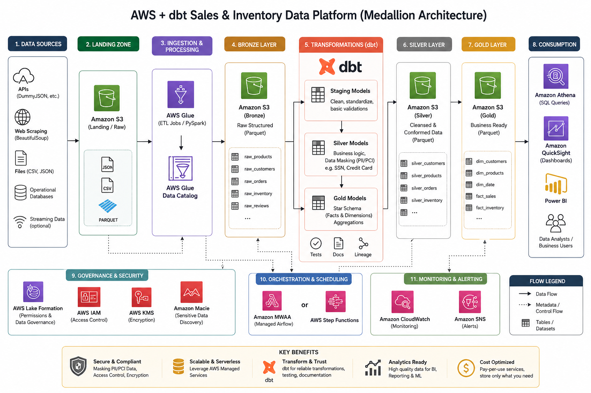

# AWS Sales & Inventory Data Platform

A modern cloud-based data platform built using AWS, PySpark, dbt, and Kimball Dimensional Modeling.

The platform ingests raw e-commerce data from DummyJSON APIs, processes it through a Medallion Architecture, and delivers analytics-ready datasets for reporting and business intelligence.

## Architecture

## Documentation

### Project Overview

* [Business Case](docs/business-case.md)
* [Architecture](docs/architecture.md)
* [Pipeline Design](docs/pipeline.md)
* [Data Model](docs/data-model.md)
* [AWS Services](docs/aws-services.md)
* [Power BI DashBoard](docs/dashboard.md)

## Technology Stack

* Amazon S3
* AWS Glue
* PySpark
* dbt
* Amazon Athena
* Power BI
* Boto3
* Parquet
* AWS IAM
* AWS KMS

## Project Scope

The platform focuses on:

* Products
* Users
* Carts

to simulate a real-world e-commerce sales and inventory analytics platform.

## Key Features

* Medallion Architecture
* S3 Lifecycle Policies
* PySpark Data Processing
* Integration Core Modeling
* Kimball Star Schema
* Cost Optimization
* Governance and Security
* Analytics-Ready Gold Layer

## Data Flow

Source → Landing → Bronze → Silver → Gold → Analytics
