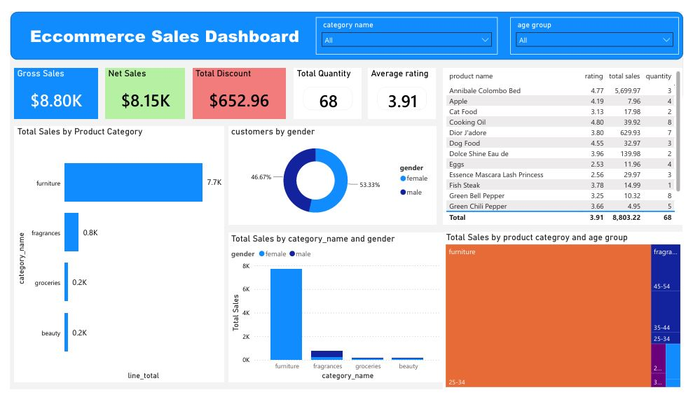

# Ecommerce Analytics Dashboard

## Overview

This dashboard provides an interactive view of ecommerce sales performance by analyzing customer purchases, product categories, demographics, and product ratings.

## Dashboard Preview

## Business Objective

The goal of this dashboard is to help business stakeholders answer questions such as:

- Which product categories generate the highest revenue?
- Which customer demographics drive sales?
- What products contribute most to total sales?
- How do sales vary across age groups and genders?
- Which products have the highest ratings?

## Key Metrics

The dashboard provides the following KPIs:

| Metric | Description |
|----------|-------------|
| Gross Sales | Total revenue before discounts |
| Net Sales | Revenue after discounts |
| Total Discount | Discounts applied to orders |
| Total Quantity | Number of units sold |
| Average Rating | Average customer product rating |

## Dashboard Features

### Filters

Users can interactively filter dashboard results by:

- Product Category
- Customer Age Group

### Sales by Product Category

Displays total sales across categories:

- Furniture
- Fragrances
- Groceries
- Beauty

This visualization quickly identifies the highest-performing product categories.

### Customer Distribution by Gender

Shows the proportion of:

- Male Customers
- Female Customers

This helps understand customer demographics.

### Sales by Category and Gender

Compares sales performance across product categories segmented by gender.

Business users can identify purchasing trends among customer groups.

### Product Performance Table

Displays:

- Product Name
- Product Rating
- Total Sales
- Quantity Sold

This enables analysis of top-performing products.

### Sales by Category and Age Group

Treemap visualization showing how revenue is distributed across:

- Product Categories
- Customer Age Groups

This helps identify valuable customer segments.
