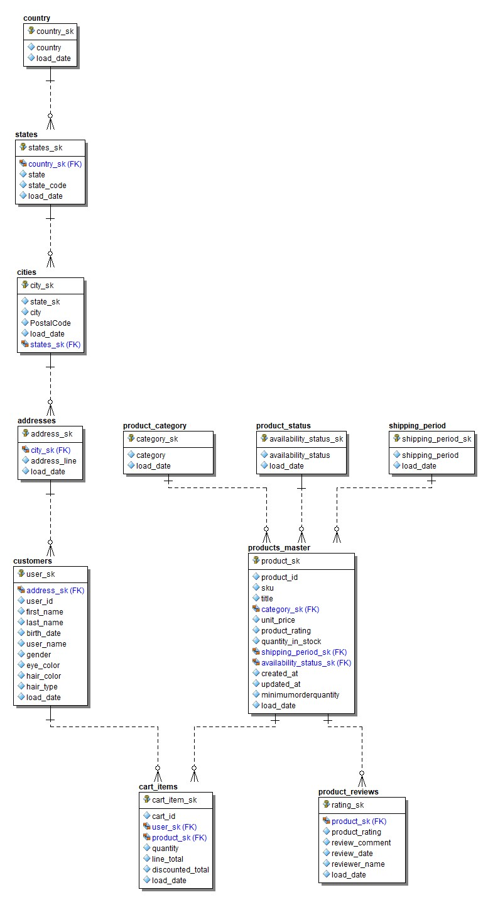
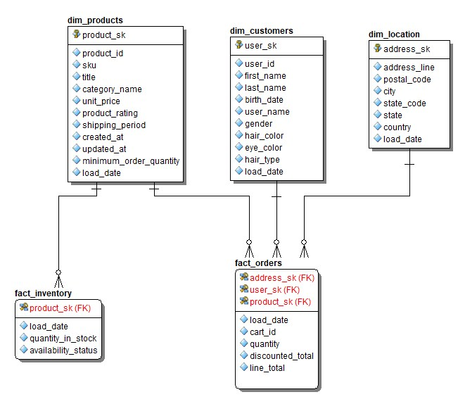

# Data Model

## Integration Core (Silver)

The Silver Layer stores normalized entities. This acts as our integration core layer for all sources we have in the organisation.

 

### Customers

Contains:

* Customer Information
* birth date
* hair type and color
  

### Products

Contains:

* Product Attributes
* Unit Pricing of products
* product rating
* stock status either available or out of stock
* minimum order quantity one can make
* quantity of products in stock

### Product_category

Contains:

* Different categories of products

### Shipping_period

Contains:
* how long it takes to ship a product e.g one week

### cart_items

Contains:

* Customer Purchases
* Transaction Information

### adresses

Contains:
* Customer geographical location

### Product Reviews
* Different reviews and ratings for a product by users who have purchased the products 

## Star Schema (Gold)
The gold layer has been designed according to kimballs star schema design. It is designed for faster reads and is highly denormalised. Its the layer from where the consumers consume our data.

### Fact Table

fact_orders

Measures:

* Quantity Sold
* Total line amount
* Discount Amount

Fact_inventory

* quantity in stock
* availability status (instock, out of stock)

### Dimensions

dim_customer

Attributes:

* Customer Name
* adress
* Gender

dim_product

Attributes:

* Product Name
* Category
* Brand

dim_date

Attributes:

* Day
* Month
* Quarter
* Year

